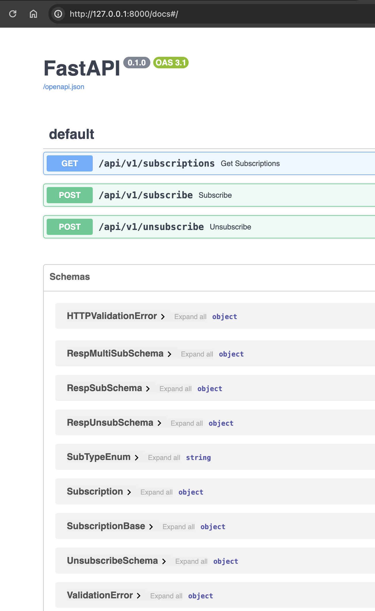
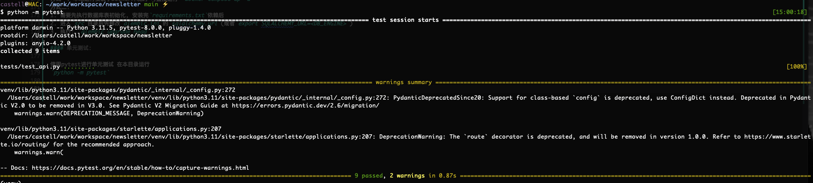

# Newsletter


## 需求分析

1. **场景**: 用户创建账号后, 决定是否订阅. 订阅方式目前有: 邮件订阅, 短信订阅.
2. **目的**: 存储用户的订阅信息, 调用方是: 其它后端应用程序或服务调用, 故实现方式是: 微服务的API服务  
3. **功能**:   
    1. 用户订阅: 新建订阅(邮件或手机), 取消订阅, 修改订阅的内容, 修改订阅的地址(邮箱或手机号)
    2. 定时发送: 创建定时发送的任务
    3. 发送任务: 外部服务可以创建发送任务, 指定发送的内容
    4. 对接短信平台: 短信发送服务
    5. 短链服务: 发送邮件和短信的链接采用短链接, 有一定的有效期


## Thoughts  
- *场景* 是否后续有新增其他的订阅方式?
- *场景* 订阅的内容有分类: 促销信息, 物流信息, 帐户变动信息etc, 代码通过布尔值做存储(e.g is_promotion)
- *功能* 创建订阅时, 校验邮箱地址/手机号合法性
- *功能* 发送任务是否需要指定发送的时间?
- *功能* 限制发送频率(避免邮件/短信轰炸, 占用短信发送额度)
- *功能* 执行发送任务成功是否需要回调?
- *功能* 短链接的链接信息增加: utm参数, 分析用户来源信息
- *基础设施* API鉴权, 监控等


## 技术 Tech
- 使用FastAPI+Sqlalchemy作为开发订阅服务的后端
- 使用Postgres存储订阅信息的数据库
- 使用Sentry作为应用错误监控和性能分析的框架
- 使用Celery作为异步任务的框架, 使用smtp发件服务器进行发送邮件时可能会比较耗时
- 使用Redis作为短链接存储的存储工具
- 可选: ElasticSearch存储日志信息


## 设计

### 表设计 Table Schema  

```SQL
CREATE TABLE public.subscription (
    id integer NOT NULL,
    user_identifier character varying(64) NOT NULL,
    sub_type public.subtypeenum NOT NULL,
    sub_address character varying(256) NOT NULL,
    is_active boolean,
    create_time timestamp without time zone,
    update_time timestamp without time zone,
    meta_flag character varying,
    is_promotion boolean
);
```

说明: 
- `user_identifier` : 用户在系统间的统一标识
- `sub_type` : 订阅类型: 邮箱/手机短信
- `sub_address` : 订阅地址, 含义取决于订阅类型: 邮箱地址/手机号
- `is_active` : 是否有效
- `is_promotion` : 是否接受促销消息  

>  是否接受某类型的消息由 `is_<notification_type>` 决定, 可根据需要增加


### API设计 API Schema 

> 可在运行程序后访问: `/docs` 查看 

--- 

- `/api/v1/subscriptions` `GET` 根据订阅信息获取订阅详情列表
*query-parameters* :
`user_identifier`: 用户唯一标识
`email`: 邮箱
`mobile`: 手机号

返回示例:
```json
{
  "msg": "string",
  "err_code": "string",
  "data": [
    {
      "user_identifier": "string",
      "sub_type": "email",
      "sub_address": "string",
      "is_active": true,
      "meta_flag": "string",
      "is_promotion": true,
      "id": 0,
      "create_time": "2024-02-05T07:00:37.261Z",
      "update_time": "2024-02-05T07:00:37.261Z"
    }
  ]
}
```

- `/api/v1/subscribe` `POST` 新建订阅 或 修改原有订阅地址

根据用户和订阅类型判断:
1. 如果该用户此订阅类型(邮箱/短信)没有订阅, 则新建订阅
2. 如果该用户此订阅类型(邮箱/短信)已经订阅, 则传入数据修改具体地址(邮箱地址/手机号)等.

Content-Type application/json

*BODY*: 

`user_identifier` 用户唯一标识 string
`sub_type` 订阅类型: "email", "sns" string
`sub_addresss` 订阅地址 tring
`is_active` 是否启用 (boolean | null) default: true
`meta_flag` 预留字段 (string | null)
`is_promotion` 是否接收促销信息 (boolean | null)

```json
{
  "user_identifier": "string",
  "sub_type": "email",
  "sub_address": "string",
  "is_active": true,
  "meta_flag": "string",
  "is_promotion": true
}
```

返回示例:
```json
{
  "msg": "string",
  "err_code": "string",
  "data": {
    "user_identifier": "string",
    "sub_type": "email",
    "sub_address": "string",
    "is_active": true,
    "meta_flag": "string",
    "is_promotion": true,
    "id": 0,
    "create_time": "2024-02-05T07:04:36.599Z",
    "update_time": "2024-02-05T07:04:36.599Z"
  }
}
```

- `/api/v1/unsubscribe` `POST` 取消订阅

可根据 1.用户唯一标识 2.邮箱 3.手机号 取消订阅

Content-Type application/json
*BODY*

`user_identifier` 用户唯一标识 (string | null)
`email` 邮箱地址 (string | null)
`mobile` 手机号 (string | null)

```json
{
  "user_identifier": "string",
  "email": "string",
  "mobile": "string"
}
```




### 测试

方式一: 本地运行安装了Docker环境的 可直接运行 `docker compose up -d` 
方式二:
1. 需要先执行数据库表初始化, 安装完`requirements.txt`依赖后
2. 进入`src`目录后先修改`alembic.ini`的`sqlalchemy.url`(或者`export SQLALCHEMY_URL=<DB_ENGINE>`)
3. 执行: `alembic upgrade head`

#### 单元测试:

使用pytest进行单元测试 在本目录运行: 
`python -m pytest`


